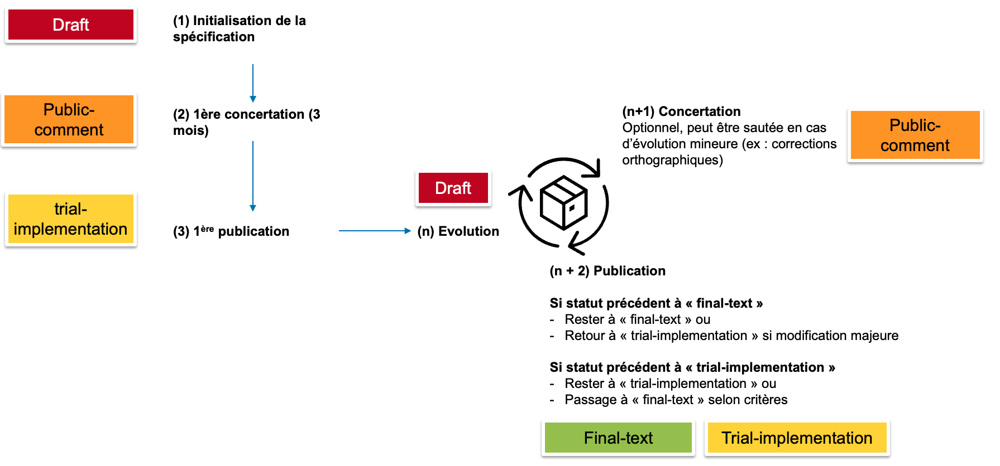

Il a été identifié qu'il n'est pas évident pour les développeurs de solutions d'identifier si la spécification est de qualité et de maturité suffisante pour pouvoir être implémentée en production sans craindre une évolution majeure dans un futur proche.
Pour d'offrir une meilleure visibilité à notre écosystème, il a été décidé de mettre en place de critères de qualité et de maturité associés à des statuts pour chacune de nos spécifications.

Cependant, il est important de noter que le statut de maturité est une information indicative. Il est toujours préférable de se baser sur des spécifications standards, même peu matures, plutôt que sur un format propriétaire. La transition vers la spécification mature sera toujours plus facile à partir d'un format standard, même au statut "draft", comparé à des interfaces propriétaire.

## Le cycle de vie et les statuts associés

Quatre statuts ont été identifiés pour les spécifications d'interopérabilité de l'ANS : "draft" ou "brouillon", "public-comment" ou "en concertation", "trial-implementation" ou "pour implementation", et "final-text" ou "final".

Ces travaux se sont inspirés des pratiques internationales au niveau d'[IHE](https://wiki.ihe.net/index.php/Process) et de [HL7](https://confluence.hl7.org/display/FHIR/FHIR+Maturity+Model
), adaptées aux besoins nationaux. Les statuts ont été inspirés des [pratiques d'IHE](https://wiki.ihe.net/index.php/Comments#Phases_of_Development), aveec un label anglais pour correspondre aux statuts IHE ainsi que sa traduction française.

Les statuts "trial-implementation" et "final-text" reflètent la maturité des spécifications dans l'ordre indiqué.

### Le statut "draft" ou "brouillon"

Ce statut correspond à une spécification **en cours de développement**, il s'agit du statut d'une spécification en cours de création ou de modification.
Le statut brouillon est particulièrement important pour les spécifications développées sur GitHub car tous les travaux sont publics et sont donc accessibles à tout moment : de la création du répertoire GitHub à la publication. Ainsi, c'est le statut d'une spécification en intégration continue ou ci-build.

### Le statut "public comment" ou "en concertation"

La spécification est publiée au statut **en concertation** lors de ses phases de consultations publiques. La spécification en mode "public comment" risque d'évoluer suite aux commentaires des concertations et n'est pas faite pour être implémentée : elle est en attente de la validation de l'écosystème pour publication.
Une spécification en « final-text » ou en « trial-implementation » peut repasser en commentaire public en cas d'évolution majeure.

### Le statut "trial-implementation" ou "pour implémentation"

La spécification est passée par une ou plusieurs phase de concertation et est **prête pour implémentation** en situation réelle.
Ce statut est un reflet de la maturité : selon l'auteur, la spécification est prète pour une première implémentation.

### Le statut "final-text" ou "final"

Les auteurs de la spécification ont estimé qu'elle avait atteint le **stade de maturité le plus élevé**.
Ce stade est atteint lorsque la spécification a déjà été mise en œuvre dans un projet national ou testée lors d'un projectathon. La spécification a eu des retours post-concertation, post-projectathon ou post-implémentation et a été corrigée. Ce statut indique également que les critères de maturité et de qualité définis ci-dessous ont été respectés.
Ce statut n'empèche pas de repasser en "trial-implementation", qui peut arriver dans le cas de changement majeur tel que la migration d'un nouveau standard.

### Les autres statuts

Une spécification peut également être "deprecated" ou "dépréciée" si celle-ci a été remplacée par une autre spécification ou "withdrawn" ou "retirée" après avoir été dépréciée depuis un moment.

### Le cycle de vie d'une spécification

Durant la vie d'une spécification, celle-ci passe par différents statuts exprimés dans le schéma ci-dessus.

A l'issue d'une concertation, une spécification peut passer au statut « final-text ou « for implementation ». Ce choix dépend du respect de critère de qualité, de maturité, et de la décision de l'auteur.
Pour passer en final-text, la spécification doit :

    <ol>
        <li> Avoir été publiée au moins une fois en "trial-implementation" </li>
        <li> Avoir été implémentée au niveau national ou testée lors de projectathons avec des retours mineurs </li>
        <li> Respecter les critères de qualité et de maturité </li>
        <li> Avoir l'aval de l'auteur qui juge la spécification suffisamment mature et qualitative pour passer à ce statut </li>
    </ol>

Notes :

    <ul>
        <li> Une version en final-text peut repasser en trial-use, par exemple en cas de changement majeur comme un refactoring complet de la spécification (passage au format IG, à FHIR R6, changement de standard, ...). Cela signifie que l'ancienne version en final-text ne doit plus être utilisée pour diverses raisons, comme une situation internationale nécessitant de grandes évolutions. Dans ce cas, une note explicative sera associée à la release. </li>
        <li> Lorsqu'une nouvelle version d'une spécification est publiée, il est recommandé aux implémenteurs de l'adopter dans les 1 à 2 ans suivant sa publication. </li>
        <li> le statut de cycle de vie n'est pas associé à la version <a href="https://semver.org/lang/fr">semver</a>. Le numéro de version d'une spécification est systématiquement incrémenté à chaque release et est indépendant du statut du cycle de vie. Par exemple, si une faute d'orthographe est corrigée entraînant une incrémentation mineure du numéro de version, cela ne justifie pas un changement de statut. A chaque release, une étude pour évaluer un éventuel changement de statut du cycle de vie sera effectuée en suivant le schéma ci-dessus. </li>
    </ul>

## Définition des critères de maturité

Une spécification avec la majorité des critères de maturité respectés indiquent sa clarté et sa facilité, et est le signe d'une plus grande pérennité de la spécification. Cependant, il est important de noter que la pérennité ne peut jamais être garantie, les spécifications jugées matures ont néanmoins une plus faible probabilité de subir des évolutions non rétrocompatibles.

Les critères de maturité identifiés :

    <ul>
        <li> Respect de l'ensemble des critères de qualité mentionnés ci-dessous </li>
        <li> (Etude en cours) Nombre d'implémentations obtenu par déclaration (par convergence ou par les DSI). Idéalement avec des retours d'expérience sur l'implémentation des spécifications </li>
        <li> Nombre de passage en projectathons, nombre de tests réalisés lors de projectathon, et nombre de partenaires </li>
        <li> Nombre d'issues et résolutions sur le repo GitHub </li>
        <li> Nombre de commentaires lors des phases de concertation </li>
    </ul>

## Définition des critères de qualité

Les critères de qualité représentent un ensemble de règles à respecter pour être conforme aux attentes nationales, permettant une uniformisation qualitative de l’ensemble de nos spécifications. Ces critères de qualité sont spécifiques à chaque standard.

Il n'est pas toujours possible de respecter strictement ces critères de qualité, car l'écosystème national ne peut pas contrôler les spécifications internationales, qui ne respectent pas forcément l'ensemble de ces critères. De plus, certaines spécifications historiques nécessitent du temps pour évoluer. L'objectif de ces critères est de les respecter et tendre le plus possible vers eux lors de la création ou mise à jour de spécifications.

Les critères de qualité **FHIR** sont :

    <ul>
        <li> Respect des bonnes pratiques nationales tel que les règles de nommages indiquées ci-dessous </li>
        <li> Respect des <a href="https://build.fhir.org/ig/FHIR/ig-guidance/best-practice.html">bonnes pratiques internationales</a></li>
        <li> Respecter le stratégie nationale des choix de version FHIR </li>
        <li> Chaque ressource de conformité doit avoir une description </li>
        <li> L'ensemble des ressources de conformité doit avoir une description précise de son usage </li>
        <li> Publication de l'IG sans erreurs (cf session Q/A) </li>
        <li> Ne pas recréer des artifacts qui existent déjà au niveau national et international (nécessite de l'expertise, de la veille et de faire une analyse de l'existant international avant de débuter les travaux.) </li>
    </ul>

Ces règles de nommage ont été établies en s'inspirant des ressources us-core

| **Paramètre** | **Objet concerné** | **Règle** | **Exemple us-core** |
| ----- | ----- | ----- | ----- |
| id | Ressources de conformité | Utiliser le format kebab-case, ex : fr-core-patient.. Lors de la création d'un IG pour un projet en particulier, il est possible de préfixer l'ensemble des ressources de conformité par le trigramme du projet (ex : "ror-...") | us-core-patient |
| title | Ressources de conformité | Similaire au nom, avec espaces. Ex : Fr Core Patient | US Core Patient Profile |
| name | Ressources de conformité |  Utiliser le format PascalCase sans espace. Ex : FrCorePatient | USCorePatientProfile |
| url | Ressources de conformité |  [base]/[ResourceType]/[id] (généré automatiquement par sushi). A noter que [ResourceType] doit respecter le nom et la casse des ressources définies dans FHIR core (ex: StructureDefinition). | http://hl7.org/fhir/us/core/StructureDefinition/us-core-patient |
| code  | SearchParameter |  Toujours en minuscule, mots séparés par des tirets "-" | gender-identity |
| name | Slice | S'il s'agit d'une extension, utiliser son id, sinon utiliser le format lowerCamelCase | us-core-genderIdentity |
| id | Package | Utiliser des minuscules | hl7.fhir.us.core [lien vers la documentation](https://confluence.hl7.org/display/FHIR/NPM+Package+Specification) |

La documentation officielle se trouve sur le [confluence d'HL7](https://confluence.hl7.org/pages/viewpage.action?pageId=35718826#GuidetoDesigningResources-NamingRules&Guidelines)

Les critères de qualité **CDA** sont :

**A remplir par l'équipe CDA**

## Définition des métadonnées associées à une spécification d'interopérabilité

Les métadonnées correspondent aux données annexées aux spécifications. Elles sont utiles à des fins de recherche notamment.

| Nom | Description | Cardinalité | Exemples |
| --- | --- | --- | --- |
| identifiant | Identifiant ou URL identifiante d’accès à la spécification | 1..1 | https://interop.esante.gouv.fr/ig/fhir/pdsm |
| statut | Statut de la spécification selon les statuts définis par l’ANS. Les statuts peuvent être rédigés en anglais ou en français. | 1..1 | draft, public-comment, for-implementation, final-text |
| version | Version au format semver | 1..1 | 1.0.0 |
| code | Code qui définit la spécification | 1..1 | GAP, CR-BIO |
| titre | Titre de la spécification | 1..1 | Gestion d'Agendas Partagés |
| description | Description succinte du périmètre de la spécification | 1..1 | Ce guide d’implémentation a pour objet de permettre la gestion de ressources (personnes, lieux ou objets), la gestion des disponibilités de ces ressources, la consultation et la synchronisation d’agenda et la prise de rendez-vous. |
| date de dernière mise à jour | Date de dernière publication de la spécification | 1..1 | 2024-04-29 |
| Standards principaux | Standards syntaxiques et sémantiques, profils sur lesquels s'appuent la spécification | 0..* | CDA, FHIR, SNOMED CT |
| Contexte projet | Projet national ou référentiel notable où la spécification est utilisée | 0..1 | Mon Espace Santé |
| Catégorie | Catégorie métier de la spécification (équivalent des technical frameworks IHE) correspondant aux préfixes des spécifications CDA | 0..* | Liste des catégories : ANEST - Anesthésie, AVC - Accident vasculaire cérébral, BIO - Biologie, CANCER - Cancer, CARD - Cardiologie, IMG - Imagerie, OBP - Obstétrique et périnatalité, OPH - Ophtalmologie, TLM - Télémédecine, VAC - Vaccination (Demande d'ajout de nouvelles catégories : issues GitHub) |
| Type | Type de spécification | 0..* | Document médical, définition d'APIs, outillage, couche métier, couche service, couche transport, documentation, ... |
| Utilisations connues | Formulaire d’auto-déclaration de conformité pour les éditeurs (à définir) | 0..* | à définir |
| Porteur | Permet d’afficher le porteur de laspécification. Particulièrement important dans le cas de l’UP externe | 1..1 | ANS, InteropSanté |
| Contact | Permet d’afficher le contact de la spécification. Particulièrement important dans le cas de l’UP externe | 1..1 | ci-sis@esante.gouv.fr |
