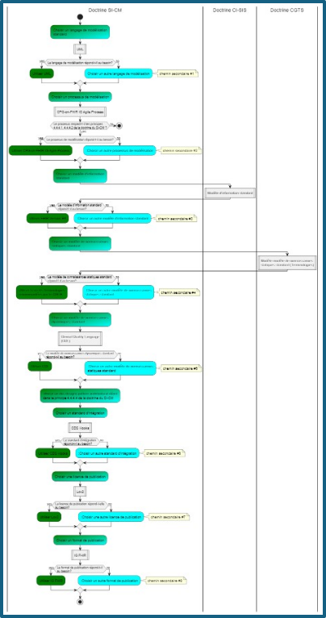

# 1. Introduction

Dans un monde où la standardisation de l’information médicale ne suffit plus à garantir la qualité des soins prodigués dans le cadre d’un Système d’Information (SI) de santé, ce document jette les premières réflexions sur une doctrine en lien avec la standardisation de la connaissance médicale en France.  

Deux événements majeurs ont poussé les responsables et les experts de l’ANS à réfléchir à un tel document. Premièrement, l’introduction d’un nouvel SI, appelé SI-CM (Système d’Information et Connaissances Médicales). Le SI-CM permettra dans un futur proche d’introduire de nouveaux volets d’interopérabilité dans le CI-SIS principalement en lien avec la standardisation des connaissances médicales issues des guides de bonnes pratiques cliniques (GBPC) et la standardisation de leur intégration dans un SI de santé. Il est également en lien avec la standardisation des critères de qualité de soins. Deuxièmement, des travaux de mise à jour de la doctrine et de la gouvernance du CI-SIS ont été menés en interne à l’ANS afin de permettre au CI-SIS de se conformer aux nouvelles tendances en informatique de façon générale et en interopérabilité des données de santé de façon plus spécifique.  

Ce document vient donc s’inscrire dans le cadre des travaux de mise à jour de la doctrine et de la gouvernance du CI-SIS. Ce document complète la doctrine du CI-SIS mise à jour en y introduisant les principes de base que doivent suivre les projets d’interopérabilités en lien avec la standardisation de la connaissance médicale apportés par le SI-CM. 

# 2. Publics concernés

Ce document s'adresse principalement aux personnes et organismes qui veulent comprendre

    <ul>
    <li>Comment les principes de la présente doctrine ont été élaborés </li>
        <ul>
        <li>Cela concerne les chapitres 3 et 4 </li>
        <li>Les profils de personnes potentiellement concernés sont : les responsables de l'ANS, les experts de l'ANS, les chercheurs en informatique médicale, les directeurs de projets </li>
        </ul>
    <li>Comme les principes de la présente doctrine ont été utilisés pour faire des choix de standards, de méthodes et d'outils pour concevoir et partager des artéfacts de connaissances médicales standardisés </li>
        <ul>
        <li>Cela concerne le chapitre 5 </li>
        <li>Les profils de personnes potentiellement concernés sont : les responsables de l'ANS, les experts de l'ANS, les chercheurs en informatique médicale, les directeurs de projets et les chefs de projet informatique </li>
        </ul>
    <li>Quels sont les standards, méthodes et outils choisis et préconisés par l’ANS si on veut standardiser des artéfacts de connaissances médicales et les intégrer sous forme d’aide à la décision cliniques </li>
    <li>Cela concerne le chapitre 5 </li>
    <li>Les profils de personnes potentiellement concernés sont : les responsables de l’ANS, les experts de l’ANS, les chercheurs en informatique médicale, les directeurs de projets, les chefs de projet informatique, les développeurs, les POs </li>
    </ul>

# 3. Le cadre de la doctrine d'ineropérabilité du SI-CM

La doctrine d’interopérabilité du SI-CM s’inscrit dans les orientations suivies par la nouvelle version de la doctrine du  CI-SIS décrite ici (1). 
La doctrine du SI-CM peut-être synthétisée ainsi 

    <ul>
    <li>Un ensemble de principes de base qui permettent de guider les choix en termes de standards, de méthodes et d’outils pour attendre l’objectif </li>
        <ul>
        <li>de modéliser et de partager de façon standard la connaissance médicale issue des GBPC. </li>
        <li>d’intégrer de façon standard (dans un SI cible) cette connaissance médicale issue des GBPC sous forme de de Système d’Aide à la Décision Clinique (SADC) </li>
        </ul>
    <li>Un chemin nominal : qui instancie les principes de la doctrine du SI-CM et décrit les choix en termes de standards de référence, de méthodes et d’outils adoptés pour atteindre les objectif sus mentionnés </li>
    <li>Un ou plusieurs chemins secondaires : décrivent le choix et l’utilisation d’un standard et / ou d’un processus de conception et / ou de mise en œuvre « non de référence ». Ce chemin secondaire peut-être justifié par le fait que le chemin nominal ne réponde pas aux besoins remontés du terrain. </li>
    </ul>

La doctrine d’interopérabilité du SI-CM décrite dans ce document couvre  

    <ol>
    <li>Les concepts en lien avec la standardisation de la connaissance médicale issue des GBPC </li> 
    <li>Les concepts en lien avec la standardisation de l’intégration de la connaissance médicale sous forme de système d’aide à la décision clinique (SADC) dans un SI de santé </li> 
    </ol>

# 4. Les principes de la doctrine du SI-CM

Une doctrine est par définition : un ensemble de principes génériques de base sur lequel s'appuie une stratégie et des plans d'actions (2). Dans ce qui suit, nous décrivons les principes sur lesquels la doctrine du SI-CM s’appuiera pour gérer les artéfacts de connaissances médicales que le SI-CM produira / exposera. Ces principes nous permettront d’instancier un chemin nominal pour la gestion des artéfacts produits / exposés par le SI-CM et un ou plusieurs chemins secondaires. Ces chemins décriront les outils de modélisation, de conception et de mise en œuvre qui devront être utilisés et/ou promus (à destination de l’écosystème) par le SI-CM pour la gestion des artéfacts de connaissances médicales en France.

Dans ce qui suit nous énonceront

    <ul>
    <li>Les principes de la doctrine du SI-CM </li> 
    <li>Le chemin nominal et la possibilité d'avoir un ou plusieurs chemins secondaires pour les différents outils de modélisation, de conception et de mise en oeuvre des artéfacts de connaissances médicales du SI-CM </li> 
    </ul>

    

### 4.1 Principes #1 : Principes issus du cadre juridique

La loi du 7 octobre 2016 (3) pour une république numérique, souvent appelée "Loi république numérique", est une législation française visant à adapter le cadre juridique aux enjeux de la transformation numérique. Cette loi est une source de « règles » pour la doctrine du SI-CM. Le SI-CM et les volets qui vont être publiés dans le CI-SIS doivent, entre autres, souscrire  

    <ul>
    <li>à l'ouverture des données produites dans le cadre de ce système d'information (SI)</li>
    <li>à rendre accessibles en ligne les données ubiques produites dans le cadre de ce SI, dans un format ouvert et réutilisable</li>
    <li>à la portabilité des données produites dans le cadre de ce SI. Les utilisateurs finaux doivent pouvoir se partager les données publiques et libres d'accès (voir chapitre sur la propriété intelectuelle)</li>
    </ul>

Plusieurs de ces principes ont été directement ou partiellement inspirés des principes FAIR et de la mouvance Open Data que nous prenons également comme base de réflexion pour la doctrine du SI-CM.

### 4.2 Principes #2 : Principes FAIR

Les principes FAIR (Findable, Accessible, Interoperable, Reusable) (4) visent à améliorer la gestion et le partage des données scientifiques. Ils sont conçus pour faciliter la découverte, l'accès, l'interopérabilité et la réutilisation des données de recherche. Ces principes peuvent être adaptés et adoptés pour la doctrine du SI-CM.  

Le SI-CM et les volets qui vont être publiés dans le CI-SIS doivent, entre autres, souscrire 

    <ul>
    <li>A ce que les artéfacts publiques produits par le SI-CM soient facilement trouvables via une plateforme dédiée. La plateforme en question doit être implémentée de façon à ce que</li>
        <ul>
        <li>Les artéfacts produits dans le cadre du SI-CM doivent être faciles à localiser pour les humains et les machines. Cela implique l'utilisation de métadonnées descriptives et de mécanismes de recherche appropriés.</li>
        <li>Les artéfacts produits dans le cadre du SI-CM doivent avoir un identifiant unique et persistant.</li>
        </ul>
    <li>A ce que les artéfacts publiques produits par le SI-CM soient accessibles en s’assurant que</li>  
        <ul>
        <li>L’accès à ces artéfacts se fasse via des protocoles standards et ouverts </li>
        <li>Les conditions d’accès à ces artéfacts soient clairement spécifiées et documentées, autant que faire se peut, via des métas donnés</li>
        </ul>
    <li>A ce que les artéfacts publiques produits par le SI-CM soient interopérables en s’assurant que</li>
        <ul>
        <li>Les artéfacts produits dans le cadre du SI-CM soient structurés de manière à pouvoir les combiner et les intégrer dans divers Sis</li>
        <li>Les artéfacts produits dans le cadre du SI-CM utilisent pour la structuration de leurs données des standards d’interopérabilité reconnus et validés par la littérature et les experts du domaine mais également par les usages</li>
        <li>Les artéfacts produits dans le cadre du SI-CM utilisent pour la structuration de leurs données des terminologies reconnues et validées par la littérature et les experts du domaine mais également par les usages</li>
        </ul>
    <li>A ce que les artéfacts publiques produits par le SI-CM soient réutilisables en s’assurant que</li>
        <ul>
        <li>Les artéfacts produits dans le cadre du SI-CM soient suffisamment documentés pour permettre la réutilisation mais également pour permettre à l’utilisateur final de connaitre le contexte métier en lien avec la production de ces artéfacts</li>
        <li>Les conditions d’utilisation et de réutilisation soient clairement énoncées, cela comprend la ou les licences de publication des artéfacts en question.</li>
        </ul>
    </ul>

### 4.3 Principes #3 : Principes du mouvement de l'Open Data

Le mouvement Open Data (données ouvertes) (5) est une initiative mondiale qui vise à rendre les données publiques librement accessibles à tous, sans restriction légales, financières ou techniques. Plusieurs des principes de ce mouvement sont partagés avec le mouvement FAIR Data. La version Five (5) Star du mouvement Open Data (6) apporte plus de précision sur les principes du mouvement Open Data. Le mouvement Five (5) Star définit une échelle et des étapes pour atteindre le niveau maximal de conformité à ces principes (Figure 1).  

La doctrine SI-CM - comme décrite plus en aval – vise à pousser l’éco système à adopter, autant que faire se peut, l’échelle maximale (5 étoiles) de conformité pour la publication des artéfacts de connaissances médicales.

Figure 1 : ENONCE SIMPLIFIE DES PRINCIPES FIVES STARS (6)

### 4.4 Princpes #4 : Principes en lien avec les bonnes pratiques d'ingénierie logicielle et de recherche

Un projet informatique quel qu’il soit doit se conformer aux principes de base de conception, d’architecture et de développement logiciel. Il en va de même pour les projets d’interopérabilité de façon générale et pour les projets d’interopérabilité des artéfacts de connaissances médicales.  

Les projets d’interopérabilité des artéfacts de connaissances médicales doivent également se conformer aux principes de base de l’ingénierie des connaissances.  

Dans ce qui suit nous listons les principes d’ingénierie que la présente doctrine doit respecter et par définition les volets du CI-SIS en lien avec le SI-CM.  

#### 4.4.1 L’utilisation des Design Patterns  

Les artéfacts de connaissances médicales publiés, développés ou partagés par le SI-CM doivent se conformer aux principes architecturaux énoncés dans la littérature et adoptés par l’écosystème des ingénieurs informatiques. Dans ce qui suit nous citons succinctement quelqu’un de ces principes. 

    <ol>
    <li>La modularité : un logiciel doit être divisé en modules ou composants distincts, chacun ayant une fonction spécifique.</li>
        <ul>
        <li>Avantages : la modularité facilite la compréhension, la maintenance et la réutilisation du code.</li>
        </ul>
    <li>L’encapsulation : permet de restreindre l'accès direct aux données et fonctions internes d'un module, exposant uniquement ce qui est nécessaire via des interfaces publiques.</li>
        <ul>
        <li>Avantages : l’encapsulation protège l'intégrité des données et réduit les interférences entre les composants.</li>
        </ul>
    <li>L’abstraction : consiste à cacher la complexité interne d’implémentation à l’utilisateur en se concentrant sur les aspects essentiels à l’utilisateur</li>
        <ul>
        <li>Avantages : améliore la clarté et permet de gérer la complexité du système en interne</li>
        </ul>
    <li>La forte cohésion : le degré auquel les éléments d'un même module sont liés fonctionnellement doit être fort.</li>
        <ul>
        <li>Avantages : les modules fortement en cohésion sont plus compréhensibles, maintenables et fiables</il>
        </ul>
    <li>Le faible couplage : les modules doivent être faiblement interdépendants</li>
        <ul>
        <li>Avantages : Un faible couplage réduit la complexité et facilite les modifications et l'évolution du système.</li>
        </ul>
    <li>La séparation des responsabilités : la responsabilité est un ensemble de fonctionnalités pris en charge par un module ou un ensemble de modules distincts. La séparation des responsabilités revient à concevoir le logiciel en groupes de modules distincts en termes de groupes de fonctionnalités</li>
        <ul>
        <li>Avantage : améliore la modularité citée plus haut mais à un niveau de modularité plus élevée</li>
        </ul>
    </ul>

Il existe bien évidemment beaucoup plus de bonnes pratiques de conception logiciel énoncés dans la littérature, voici quelques références de base (7) (8) (9) (10). 

#### 4.4.2 L'adoption d'un processus de conception logiciel

Un projet en lien avec la standardisation et/ou l’interopérabilité des données de santé est un projet informatique à part entier. Il est donc nécessaire d’adopter un processus de conception logiciel adéquat pour structurer et organiser la conception et le développement des artéfacts produits par le projet en question. Les processus de conception doivent à minima inclure les étapes : collecte des exigences, la modélisation, la création de prototypes, et la validation des concepts avant la phase de développement. 

Les processus de conception logiciels les plus utilisés en ingénierie des logiciels à l’heure actuelle sont ceux issus du mouvement Agile. De nombreux « framework Agiles » existe, tels que : Scrum, Kanban, XP, Lean, Scaled Agile Framework,… 

__L’ingénierie des connaissances__

Les projets en lien avec la connaissance sont également gérés suivant des processus de conception en lien avec une discipline appelée : l’ingénierie des connaissances (11) (12). L’ingénierie des connaissances se concentre sur la création, la gestion et l’utilisation de la connaissance dans les systèmes informatiques. Elle implique la collecte, la structuration, la formalisation et la mise en œuvre des connaissances pour développer des systèmes intelligents capables de résoudre des problèmes complexes. Cette discipline est essentielle dans des domaines tels que  l'intelligence artificielle, les bases de connaissances et bien évidemment la structuration et la standardisation de la connaissance (médicale).  

Les projets en lien avec la standardisation de la connaissance médicale doivent adopter un processus de conception Agile d’ingénierie des connaissances. Les artéfacts produits dans chaque étape de conception (de transformation de la connaissance) doivent être visibles et explicites pour chaque volet du SI-CM suivant le design pattern décrit ici … 

#### 4.4.3 L'adoption d'un langage de modélisation standard

Les langages de modélisation standard en ingénierie des logiciels sont des outils essentiels pour représenter visuellement les structures, les comportements et les interactions au sein d'un système logiciel. Ils permettent de faciliter la compréhension, la communication et la documentation des concepts complexes entre les parties prenantes. Parmi les langages de modélisation les plus utilisés, on retrouve : Unified Modeling Language (UML), SysML (Systems Modeling Language), Business Process Model and Notation (BPMN)… 

Ces langages de modélisation standard jouent un rôle crucial dans la conception, l'analyse et la gestion des projets de développement logiciel, en assurant une vision cohérente et partagée du système à construire. 

Le mouvement Agile n’impose pas de langage de modélisation particulier mais le manifeste Agile insiste sur l’attention continue que doit porter l’équipe de développement logiciel à l'excellence technique et à la conception basée sur les bonnes pratiques mais également sur la facilitation de la transmission de l’information entre les membres de l’équipe du projet. L’utilisation d’un langage de modélisation standard dans un processus de conception Agile permet de combiner les avantages de la modélisation formelle avec la flexibilité et la réactivité des méthodes agiles. Un langage de modélisation peut être utilisé de manière pragmatique pour clarifier les exigences, faciliter la communication entre les équipes et documenter les architectures logicielles de manière succincte. Ambler (13) et Rumbaugh (14), estime que l'intégration d'UML (par exemple, N.D.L.R) dans les pratiques agiles aide à maintenir la cohérence et la compréhension commune du projet tout en respectant les principes agiles de simplicité et de réponse rapide aux changements. 

Le processus de conception adopté dans le cadre de la gestion des artéfacts des connaissances médicales du SI-CM doit également adopter un (ou plusieurs) langage de modélisation standards. 

#### 4.4.4 L'adoption des Designs Patterns en ingénierie des connaissances pour la standardisation des GBPC et leur intégration dans un SI de santé

En ingénierie des connaissances et plus particulièrement dans le cadre défini en paragraphe 2 de cette doctrine, nous avons identifié 3 designs patterns que le SI-CM doit respecter dans la gestion des artéfacts de connaissances médicales

##### 4.4.4.1 L'architecture tri dimentionnel de Rector et al. (15)

La standardisation des GBPC dans le cadre du SI-CM doit combiner et interfacer trois types de modèles (Figure 2) 

    <ul>
    <li><strong>Information about specific patients and clinical situations</strong> : ce modèle dit d’informations médicales permet de standardiser les informations issues du dossier patient</li>
    <li><strong> General patient-independent information about medicine and medical practice </strong>: ce modèle dit de connaissances métiers comprend 2 sous modèles</li>
    <li><strong>Guideline independent static knowledge</strong>: un modèle de connaissances métiers dit statique. C’est ce qui correspond le plus dans le jargon de l’interopérabilité aux modèles définis par les terminologies médicales.</li>
    <li><strong> Guideline dependent dynamic knowledge model</strong>: Ce modèle dit d’inférence a pour objectif de modéliser comment on infère les conclusions et les décisions d’informations spécifiques au patient et des faits indépendants décrit dans le GBPC.</li>
    </ul>

Figure 2 : Les modèles de l’architecture tri dimensionnel de Rector et al. (15) et leurs interfaces

##### 4.4.4.2 La représentation multi couches de la connaissance médicale de Boxwala et al (16)

La standardisation des GBPC dans le cadre du SI-CM doit respecter les différents niveaux de structuration de la connaissance décrits dans (16) (Tableau 1) Les documents de spécifications pour chaque volet du SI-CM doivent pouvoir décrire la structuration de la connaissance médicale du GBPC cible suivant ces quatre formats de représentation  

    <ol>
    <li><strong>Narratif<strong> : ce format correspond au texte brut de la recommandation du GBPC cible ainsi que le lien vers la recommandation en question.</li>
        <ul>
        <li>Ce format doit être lisible et partageable par tous</li>
        <li>Ce format doit être indépendant de toute technologie d’implémentation</li>
        <li>Ce format doit être indépendant du contexte de mise en œuvre</li>
        <li>Ce format est produit par les experts métiers producteurs du GBPC</li>
        <li>Ce format a pour but de définir une politique de santé publique basée sur les faits et la connaissance</li>
        </ul>
    <li><strong>Semi structuré</strong> : Ce format correspond à une interopération du texte brut en vue de sa structuration. Ce format permet de définir à partir du texte brut : le qui, le quoi, le quand, le où et le pourquoi. Il permet de définir les concepts statiques qui composent la recommandation et d’identifier les terminologies auxquels ils peuvent correspondre. Ce format est généralement une combinaison de texte structuré et de diagrammes d’activités UML. </li>
        <ul>
        <li>Ce format doit être lisible et partageable par tous</li>
        <li>Ce format doit être indépendant de toute technologie d’implémentation</li>
        <li>Ce format doit être indépendant du contexte de mise en œuvre</li>
        <li>Ce format doit être co écrit par un expert du domaine métier ainsi que par un expert informatique en ingénierie des connaissances</li>
        <li>Ce format a pour but de structurer le texte brut de la recommandation en vue de sa standardisation et implémentation sous forme d’aide à la décision clinique</li>
        </ul>
    <li><strong>Structuré<strong> : Ce format doit impérativement correspondre au modèle appelé : Guideline dependent dynamic knowledge model décrit en paragraphe 4.4.4.1.</li>
        <ul>
        <li>Ce format est interprétable par la machine</li> 
        <li>Ce format doit être lisible et partageable par tous</li> 
        <li>Ce format doit être indépendant de toute technologie d’implémentation</li> 
        <li>Ce format doit être indépendant du contexte de mise en œuvre</li> 
        <li>Ce format est généralement écrit par l’expert en structuration de la connaissance médicale et en standardisation / interopérabilité</li> 
        <li>Ce format doit servir à partager la connaissance médicale standardisée et interopérable. Ce format doit servir à valider le contenu de la connaissance médicale avec un interpréteur (raisonneur).</li>
        </ul> 
    <li><strong>Exécutable</strong>: Ce format correspond au code exécutable par un SADC.</li> 
        <ul>
        <li>Ce format est interprétable par la machine</li> 
        <li>Ce format n’est pas lisible par l’humain et n’est pas partageable</li> 
        <li>Ce format est dépendant de la technologie de mise en œuvre du SADC qui l’exploite</li> 
        <li>Ce format est dépendant du contexte de mise en œuvre du SADC qui l’exploite </li>
        <li>Ce format doit servir à la mise en œuvre d’un SADC pour un SI particulier</li>
        </ul>
    </ol>

 

Tableau 1 : les quatre couches de formats de représentation de la connaissance médicale selon Boxwala et al. (16)

##### 4.4.4.3 L'intégration standardisée des SADC basés sur les GBPC dans un SI de santé

La connaissance médicale issue des GBPC standardisée dans le cadre du SI-CM n’aura de valeur que si elle est déployée et exploitée par l’écosystème. Une des stratégies préconisées dans la littérature pour faciliter l’adoption de cette connaissance par les professionnels de santé est son déploiement sous forme de SADCs (17). Une des principales barrières décrites dans la littérature à l’adoption des SADC (basés ou non sur une connaissance médicale standardisée) par l’écosystème est la mauvaise scalabilité de ces systèmes. Adopter un standard d’intégration et d’exposition des SADCs est une des solutions architecturales préconisées dans la littérature pour améliorer la scalabilité des SADCs (18). La connaissance médicale standardisée dans le cadre du SI-CM doit pouvoir s’intégrer dans un SI de santé sous forme d’un SADC en adoptant un standard d’intégration.

##### 4.4.4.4 Se positionner par rapport aux Design Patterns architecturaux génériques

Les solutions logicielles conçues dans le cadre des problématiques posées par l’interopérabilité en santé doivent être réfléchies à un niveau d’abstraction qui permet d’instancier ces solutions de façons différentes autant de fois qu’elles seront utilisées sur le terrain pour un cas d’usage. C’est là, la définition même d’un Design Pattern. Les Design Patterns produits par les différentes sociétés savantes : HL7, IHE, IEEE,…peuvent être de trois catégories 

    <ol>
    <li>Un modèle d’information standard : définie un modèle de données standard qui doit circuler dans des messages d’interopérabilité pour un cas d’usage X.</li> 
    <li>Un design pattern architectural : définie une solution logicielle standard qui s’appuie sur un modèle d’information standard pour résoudre un problème d’interopérabilité Y de façon standard.</li> 
    <li>Un design pattern architectural de contenu standard : instancie un design pattern architectural pour répondre à un cas d’usage particulier. Ce type de Design Pattern est le plus répondu.</li>  
    </ol>

Les spécifications définies et / ou exposées par le SI-CM doivent se positionner par rapport à ces trois types de design pattern architecturaux génériques.  

__Pourquoi il est important de se positionner par rapport aux différentes catégories de Design Pattern ?__  

L’interopérabilité telle qu’adoptée actuellement par l’éco système à travers le monde est basée sur la notion de cas d’usage. Chaque cas d’usage donne lieu à des spécifications qui sont censées répondre aux besoins décrits dans le cas d’usage. Cependant le risque est d’écrire des spécifications qui se chevauchent ou des spécifications dupliquées. Il est donc nécessaire à chaque début de projet de se positionner par rapport aux Design Patterns architecturaux générique décrits plus en amont pour pouvoir identifier les spécifications déjà existantes et pouvoir les réutiliser totalement ou partiellement. Ce principe rejoint les principes de modularité et de séparation des responsabilité décrits en paragraphe 4.4.1. 

### 4.4.5 La mise à jour de la doctrine guidée par la recherche

Une grande partie des principes énoncés plus en amont est basée sur des concepts issus de la recherche scientifique. Certains de ces concepts sont validés et adoptés par l’écosystème de l’ingénierie qui les exploite déjà dans des projets informatiques en routine, exemple : les design pattern de structuration des GBPC qui date de plus de 25 ans. D’autres concepts sont en cours d’évaluation par la communité des chercheurs et d’adoption par l’écosystème de l’ingénierie, exemple : le standard CDS Hooks (19).  

Il est donc nécessaire pour la doctrine du SI-CM de garder un œil sur l’évolution de certains concepts au regard de l’avancée de l’évaluation et de l’adoption de ces concepts en parcourant régulièrement les articles scientifiques correspondants.  

### 4.5 Principes #5 : Définir la relation avec les doctrines du CI-SIS et CGTS

Les artéfacts produits et gérés par le SI-CM sont en étroites relation avec ceux produits et gérés par le CI-SIS et le CGTS (voir chapitre précédent). Les artéfacts produits et gérés par le SI-CM peuvent réutiliser, tout ou partie des artéfacts produits et gérés par le CI-SIS et le CGTS.  

Les volets produits et gérés dans le cadre du SI-CM doivent, autant que faire se peut, partager les mêmes principes que le CI-SIS dans leur doctrine respective ou à défaut des principes qui ne se contredisent pas. La doctrine du SI-CM doit s’inscrire dans la continuité et / ou la complémentarité de celle du CI-SIS et du CGTS et vis vers ça.  

Les artéfacts de connaissances médicales qui suivent le principe de l’architecture tri-dimensionnelle de Rector et al. (15) (chapitre 3.4.4.1) doivent partager, autant que faire se peut, le même modèle d’information médicale que le CI-SIS et le même modèle de connaissance métier statique que le CGTS. 

# 5. Les remines de la doctrine du SI-CM

Ce paragraphe décrit une instanciation nominale (et plusieurs instanciations secondaires) de la doctrine du SI-CM basée sur les principes énoncés plus en amont. Cette instanciation correspond à une série de choix de standards, d’outils, de méthodes et de règles que le SI-CM devra respecter pour gérer les artéfacts de connaissances médicales issus de la standardisation des GBPC produits et/ou exposés par l’ANS. 

Ce chemin nominal n’est ni immuable ni parfait, il est et il sera donc sujet à mise à jour et / ou à des dérivations de chemins secondaires suivants les cas d’usage et l’évolution dans le temps des principes énoncés plus en amont.   

Dans ce qui suit nous décrivons le chemin nominal ainsi que les possibles chemins secondaires de la doctrine du SI-CM. 

### 5.1 Le chemin nominal de la doctrine du SI-CM

Comme décrit en chapitre 2, la doctrine du SI-CM est un ensemble d’activités consistants à identifier et à choisir, en se basant sur les principes de la doctrine, les standards, outils et autres méthodes qui permettront à l’ANS de concevoir et gérer les artéfacts de connaissances médicales standardisés.  

La figure 4 décrit un diagramme d’activité UML qui montre les activités d’identification des standards et outils en question. Toutes les activités en couleur verte ou vert bleuté correspondent à des activités du chemin nominal i.e. les outils et standards que l’ANS utilisera par défaut quel que soit le cas d’usage. Ces outils seront également ceux que l’écosystème devra utiliser dans le cas où l’ANS est saisie pour travailler sur un cas d’usage proposé par l’écosystème. Toutes les activités en bleu et vert bleuté correspondent à des chemins secondaires pour cette doctrine i.e. les cas où l’outil ou le standard préconisés par l’ANS ne répond pas au besoin du cas d’usage et nécessite d’investiguer d’autres outils ou standards.  

Dans ce qui suit nous justifions nos choix d’outils et/ou standards pour le chemin nominal décrits en figure 4 en faisant la relation avec les principes de la doctrine énoncés plus en amont. 

#### 5.1.1 Relations entre les principes de la doctrine du SI-CM et les activités du chemin nominal instancié

##### 5.1.1.1 Choisir un langage de modélisation

Cette activité est en relation avec le principe #4, chapitre 3.4.2 énoncé en amont. Le langage de modélisation standard choisi pour illustrer les étapes de conception et de structuration des artéfacts de connaissances médicales issues des GBPC dans la doctrine du SI-CM est le langage standard UML version 2.0 (20). 

Ce choix est justifié pour plusieurs raisons 

    <ul>
    <li>UML s’articule avec le principe #4 de la présente doctrine</li> 
    <li>UML est le langage standard de modélisation en informatique depuis l’avènement de la mouvance orientée objet</li> 
    <li>UML est actuellement utilisé par de nombreux projets de standardisation de la connaissance médicale</li>  
    <li>UML s’articule avec l’ensemble des autres standards choisis dans le chemin nominal de la présente doctrine</li> 
    </ul>

##### 5.1.1.2 Choisir un processus de modélisation

Cette activité est en relation avec le principe #4, chapitre 3.4.3 énoncé en amont. Le processus choisi pour encadrer le travail de conception et de structuration des artéfacts de connaissances médicales issues des GBPC dans la doctrine du SI-CM est le processus Agile décrit dans le FHIR IG CPG-on-FHIR (21). 

Ce choix est justifié pour plusieurs raisons :

    <ul>
    <li>FHIR IG CPG-on-FHIR (21) s’articule avec les principes #4 de la présente doctrine</li> 
    <li>FHIR IG CPG-on-FHIR (21) s’articule avec l’ensemble des autres standards choisis. FHIR IG CPG-on-FHIR  (21) permet de mettre en œuvre ensemble les différents modèles préconisés par l’architecture tri-dimensionnelle de Rector et al. (15) il permet de mettre en œuvre le standard UML pour illustrer les différentes étapes de conception. Il permet de mettre en œuvre la représentation multi couches de la connaissance médicale de Boxwala et al. (16).</li> 
    <li>FHIR IG CPG-on-FHIR (21) est actuellement utilisé par de nombreux projets de standardisation de la connaissance médicale</li>  
    </ul>

##### 5.1.1.3 Choisir un modèle d'information standard

Cette activité est en relation avec le principe #4, chapitre 3.4.4.1 et les principes #1, #2, #3 et #5 énoncés en amont. Le modèle d’information standard choisi pour standardiser les informations issues du dossier patient est FHIR en version R4 (22). 

Ce choix est justifié pour plusieurs raisons :

    <ul>
    <li>FHIR en version R4 s’articule avec l’ensemble des principes énoncés en amont</li>   
    <li>FHIR en version R4 s’articule avec l’ensemble des autres standards choisis</li>
    <li>FHIR en version R4 s’articule avec les autres modèles correspondants au principe d’architecture tri-dimensionnelle de Rector et al. La figure 3 illustre l’instanciation de ce principe avec les différents modèles choisis pour la présente doctrine.</li>
    <li>FHIR en version R4 est actuellement utilisé par de nombreux projets de standardisation de la connaissance médicale</li>   
    <li>FHIR en version R4 s’articule avec le choix de la doctrine du CI-SIS</li>   
    </ul>

##### 5.1.1.4 Choisir un modèle de connaissances statiques standard

Cette activité est en relation avec le principe #4, chapitre 3.4.4.1 et les principes #1, #2, #3 et #5 énoncés en amont. La ou les terminologies médicales choisies pour structurer les artéfacts de connaissances issus de la standardisation des GBPC sont celles recommandées par la doctrine du CGTS. 

Ce choix est justifié pour plusieurs raisons :

    <ul>
    <li>Les terminologies gérées par le CGTS (via le SMT) s’articulent avec l’ensemble des principes énoncés en amont</li> 
    <li>Les terminologies gérées par le CGTS (via le SMT) s’articulent avec l’ensemble des autres standards choisis </li> 
    <li>Les terminologies gérées par le CGTS (via le SMT) s’articulent avec les autres modèles correspondants au principe d’architecture tri-dimensionnelle de Rector et al (15). La figure 3 illustre l’instanciation de ce principe avec les différents modèles choisis pour la présente doctrine.</li>  
    <li>Les terminologies gérées par le CGTS (via le SMT) sont actuellement utilisées par de nombreux projets de standardisation de la connaissance médicale</li> 
    <li>Les terminologies gérées par le CGTS (via le SMT) s’articulent avec la doctrine du CGTS</li>
    </ul>

##### 5.1.1.5 Choisir un modèle de connaissances dynamiques standard

Cette activité est en relation avec le principe #4, chapitre 3.4.4.1 et les principes #1, #2, #3 et #5 énoncés en amont. Le modèle de connaissances dynamiques choisie pour standardiser l’écriture des artéfacts de connaissances médicales issues des GBPC est CQL (23).  

Ce choix est justifié pour plusieurs raisons :

    <ul>
    <li>CQL s’articule avec l’ensemble des principes énoncés en amont</li>
    <li>CQL s’articule avec l’ensemble des autres standards choisis : UML, FHIR R4, CDS Hooks,…</li>
    <li>CQL s’articule avec les autres modèles correspondants au principe d’architecture tri-dimensionnelle de Rector et al. La figure 3 illustre l’instanciation de ce principe avec les différents modèles choisis pour la présente doctrine.</li> 
    <li>CQL est actuellement utilisé par de nombreux projets de standardisation de la connaissance médicale</li> 
    <li>CQL s’articule avec la doctrine du CI-SIS et la doctrine du CGTS</li>
    </ul>

FIGURE 3 : Instanciation du modèle de Rector et al. avec l’ensemble des standards utilisés dans le chemin nominal de la doctrine du SI-CM

##### 5.1.1.6 Choisir un standard d'intégration 

Cette activité est en relation avec le principe #4, chapitre 3.4.4.3. Le standard d’intégration de la connaissance médicale sous forme de SDAC choisi par l’ANS est le standard CDS Hooks (19).  

Ce choix est justifié pour plusieurs raisons :

    <ul>
    <li>CDS Hooks s’articule avec l’ensemble des principes énoncés en amont</li> 
    <li>CDS Hooks est le seul standard d’intégration de SAD basés sur la standardisation des GBPC qui puisse s’articuler avec les standards choisis dans le chemin nominal de la présente doctrine : UML, FHIR R4, CQL,…</li> 
    <li>CDS Hooks est actuellement utilisé par de nombreux projets de standardisation de la connaissance médicale</li> 
    </ul>

##### 5.1.1.7 Choisir une licence de publication

Cette activité est en relation avec le principe #3 et le principe #5 de la présente doctrine. Tous les artéfacts de connaissances médicales publiés dans le cadre du SI-CM doivent l’être sous la licence « Licence Ouverte Version 2.0 » (Lov2) d’Etalab (24). 

Ce choix est justifié pour plusieurs raisons :

    <ul>
    <li>La licence « Licence Ouverte Version 2.0 » (Lov2) suit la logique du mouvement de l’Open Data</li>   
    <li>La licence « Licence Ouverte Version 2.0 » (Lov2) est celle choisie par la doctrine du CGTS</li> 
    </ul>

##### 5.1.1.8 Choisir un format de publication standard

Cette activité est en relation avec le principe #1, #2, #3 et #5 de la présente doctrine. Les artéfacts de connaissances médicales définis et / ou exposés dans le cadre du SI-CM doivent être publiés suivant le format FHIR ImplementationGuide (IG). 

Ce choix est justifié pour plusieurs raisons :

    <ul>
    <li>FHIR ImplementationGuide (IG) s’articule avec l’ensemble des principes énoncés en amont</li>  
    <li>FHIR ImplementationGuide (IG) avec l’ensemble des standards choisis dans le cadre du chemin du nominal de la présente doctrine : UML, FHIR R4, CQL, …</li>  
    <li>FHIR ImplementationGuide (IG) est actuellement utilisé dans de nombreux exemples de mises en œuvre de projet en lien avec la standardisation de la connaissance médicale</li>   
    <li>FHIR ImplementationGuide (IG) s’articule avec la doctrine du CI-SIS</li> 
    </ul>

 

Figure 4 : Diagramme d’activité UML pour illustrer les choix du chemin nominal de la doctrine du SI-CM et les possibles chemins secondaires

### 5.2 Les chemins secondaires de la doctrine du SI-CM

Les choix effectués dans le chemin nominal de la présente doctrine ne sont pas et ne doivent pas être définitifs. Ces choix peuvent être remis en question pour de nombreuse raisons 

    <ul>
    <li>Le standard choisi n’est plus d’actualité</li>   
    <li>Le standard choisi n’a pas évolué par rapport aux autres standards</li>  
    <li>Il existe un ou plusieurs standards plus adaptés à un cas d’usage donné</li>  
    <li>Un ou plusieurs principes de la présente doctrine ou de la doctrine du CI-SIS et/ou du CGTS ont évolué</li>  
    <li>…</li>
    </ul>

   

Il est donc nécessaire de laisser la porte ouverte à chaque étape de se poser la question de faire un autre choix de standard, d’outils ou autres méthodes. Pour cela, il est nécessaire que l’ensemble des parties prenantes  

    <ul>
    <li>Soient interrogés en cas de nouveaux choix effectués par l’ANS</li> 
    <li>Aient la possibilité de proposer de nouveaux choix à l’ANS pour un cas d’usage donné</li>
    </ul>

  

A l’image de la doctrine du CI-SIS ou de la doctrine du CGTS, la présente doctrine définie une procédure de consultation sur les différentes étapes où un autre choix est possible. La procédure de consultation comprend résolument les mêmes étapes que celles décrites dans la doctrine du CI-SIS (1).  

Les chemins secondaires #1, #2, #3, #4, #5, #6 et #8 décrits dans la figure 4 sont concernés par cette procédure de consultation. 

Les choix faits au cours de ces chemins secondaires doivent impérativement respecter les principes de la présente doctrine. Ils doivent être des instances de ces principes, à l’image de l’instanciation du chemin nominal.  

Le chemin secondaire #7 concerne la propriété intellectuelle des artéfacts de connaissances médicales produits et / ou exposés par le SI-CM. A l’image de la doctrine du CGTS (1), un acteur de l’éco système peut décider de distribuer ses artéfacts de connaissances sous un autre régime de propriété intellectuelle que la Licence Lov2 choisie dans le chemin nominal de la présente doctrine. Ce choix de licence de diffusion résultera des négociations entre le SI-CM et l’Unité de Production (UP) lors de l’établissement de la convention de mise à disposition des artéfacts en question.  

La notion d’UP et de conventions entre l’ANS et les UPs sont celles définies dans la gouvernance du CI-SIS (25). 

# 6. La relation avec la gouvernance

Cette doctrine respecte les étapes et les règles de gouvernance énoncés dans la gouvernance du CI-SIS (25). 

##  Références

    <ol>
    <li>Le CI-SIS au cœur du développement de la e-santé [Internet]. [cited 2024 Aug 29]. Available from: https://ansforge.github.io/CISIS-doctrine-gouvernance/</li> 
    <li>Doctrine. In: Wikipédia [Internet]. 2024 [cited 2024 Aug 29]. Available from: https://fr.wikipedia.org/w/index.php?title=Doctrine&oldid=212118223</li> 
    <li>LOI n° 2016-1321 du 7 octobre 2016 pour une République numérique (1). 2016-1321 Oct 7, 2016.</li>  
    <li>GO FAIR [Internet]. [cited 2024 Aug 29]. FAIR Principles. Available from: https://www.go-fair.org/fair-principles/</li> 
    <li>Open data. In: Wikipedia [Internet]. 2024 [cited 2024 Aug 29]. Available from: https://en.wikipedia.org/w/index.php?title=Open_data&oldid=1238576109</li> 
    <li>Open Data 5 étoiles [Internet]. [cited 2024 Aug 29]. Available from: http://5stardata.info/fr/ </li>
    <li>Gamma E, Helm R, Johnson R, Vlissides J. Design Patterns: Elements of Reusable Object-Oriented Software. 1er édition. Boston, Mass. Munich: Addison Wesley; 1994. 416 p.</li>  
    <li>Martin R. Clean Code: A Handbook of Agile Software Craftsmanship. 1er édition. Upper Saddle River, NJ: Pearson; 2008. 464 p.</li>  
    <li>The Pragmatic Programmer: your journey to mastery, 20th Anniversary Edition, 2nd Edition[Book] [Internet]. [cited 2024 Aug 29]. Available from: https://www.oreilly.com/library/view/the-pragmatic-programmer/9780135956977/ </li>
    <li>Martin RC. Agile Software Development: Principles, Patterns, and Practices. USA: Prentice Hall PTR; 2003. 710 p.</li>  
    <li>Schreiber GT, Akkermans H. Knowledge engineering and management: the CommonKADS methodology. Cambridge, MA, USA: MIT Press; 2000. </li> 
    <li>giantchair.com. Artificial Intelligence: A Modern Approach - Pearson France [Internet]. [cited 2024 Aug 29]. Available from: https://www.pearson.fr/fr/book/?GCOI=27440100705580 </li>
    <li>Ambler SW. The Object Primer: Agile Model-Driven Development With Uml 2.0. 3e édition. Cambridge, UK : New York: Cambridge University Press; 2004. 572 p.</li>  
    <li>Rumbaugh J, Jacobson I, Booch G. Unified Modeling Language Reference Manual, The (2nd Edition). Pearson Higher Education; 2004. </li> 
    <li>Rector AL, Johnson PD, Tu SW, Wroe C, Rogers J. Interface of Inference Models with Concept and Medical Record Models. In: Quaglini S, Barahona P, Andreassen S, editors. Artificial Intelligence Medicine, 8th Conference on AI in Medicine in Europe, AIME 2001, Cascais, Portugal, July 1-4, 2001, Proceedings [Internet]. Springer; 2001 [cited 2024 Aug 29]. p. 314–23. (Lecture Notes in Computer Science; vol. 2101). Available from: https://doi.org/10.1007/3-540-48229-6\_43 </li>
    <li>Boxwala AA, Rocha BH, Maviglia S, Kashyap V, Meltzer S, Kim J, et al. A multi-layered framework for disseminating knowledge for computer-based decision support. Journal of the American Medical Informatics Association. 2011 Dec 1;18(Supplement_1):i132–9.</li>  
    <li>Graham ID, Logan J, Harrison MB, Straus SE, Tetroe J, Caswell W, et al. Lost in knowledge translation: Time for a map? Journal of Continuing Education in the Health Professions. 2006;26(1):13–24.</li>  
    <li>Marcial LH, Blumenfeld B, Harle C, Jing X, Keller MS, Lee V, et al. Barriers, Facilitators, and Potential Solutions to Advancing Interoperable Clinical Decision Support: Multi-Stakeholder Consensus Recommendations for the Opioid Use Case. AMIA Annu Symp Proc. 2019;2019:637–46.</li>  
    <li>CDS Hooks [Internet]. [cited 2018 Apr 12]. Available from: http://cds-hooks.org/</li> 
    <li>About the Unified Modeling Language Specification Version 2.0 [Internet]. [cited 2024 Aug 29]. Available from: https://www.omg.org/spec/UML/2.0/</li> 
    <li>CPG Home - Clinical Practice Guidelines v2.0.0-ballot [Internet]. [cited 2024 Aug 30]. Available from: https://hl7.org/fhir/uv/cpg/2024Jan/</li> 
    <li>Http - FHIR v4.0.1 [Internet]. [cited 2021 Dec 1]. Available from: https://www.hl7.org/fhir/http.html</li> 
    <li>Clinical Quality Language (CQL) [Internet]. [cited 2024 Aug 30]. Available from: https://cql.hl7.org/</li> 
    <li>Etalab Licence Ouverte V2.0 [Internet]. 2017. Available from: https://www.etalab.gouv.fr/wp-content/uploads/2017/04/ETALAB-Licence-Ouverte-v2.0.pdf</li>
    <li>Généralités sur la Gouvernance du CI-SIS [Internet]. [cited 2024 Aug 30]. Available from: https://ansforge.github.io/CISIS-doctrine-gouvernance/pages/docs/generalites-gouv.html</li> 
    </ol>

  